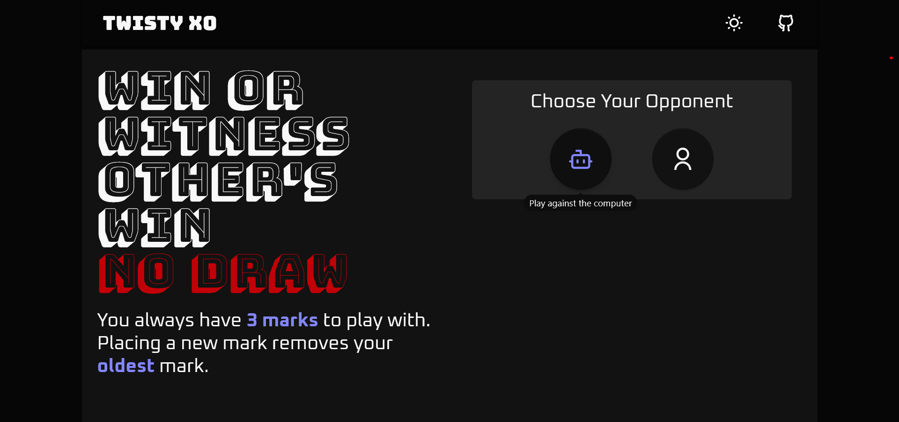
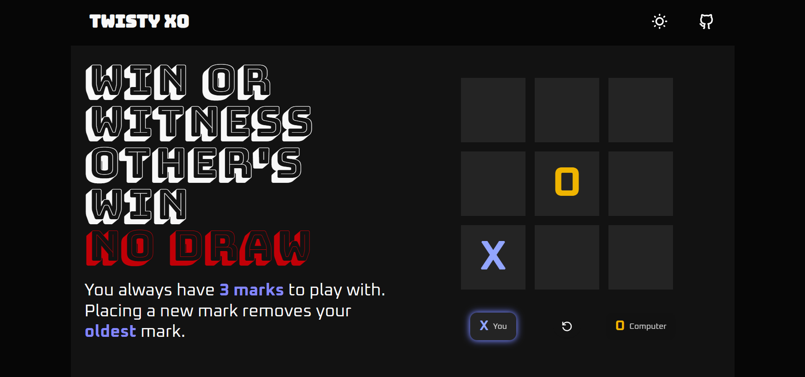
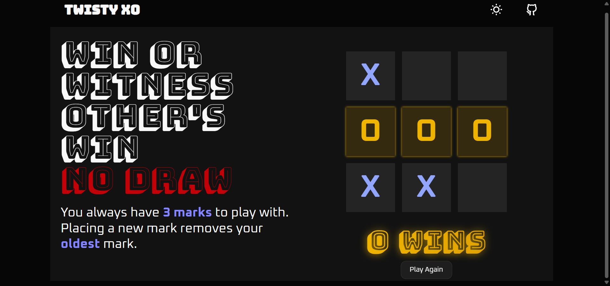
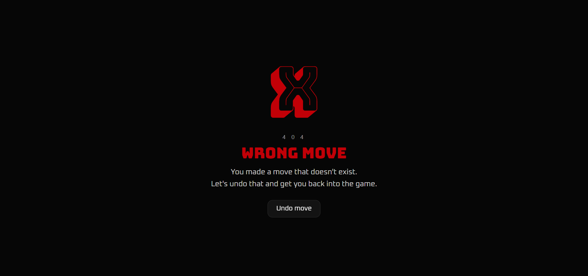
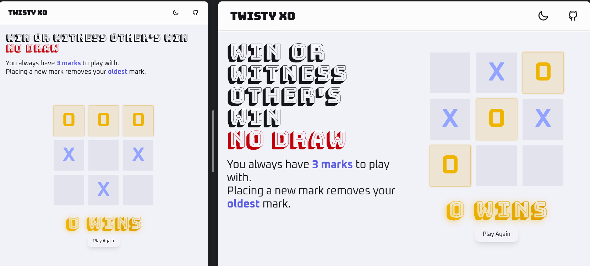
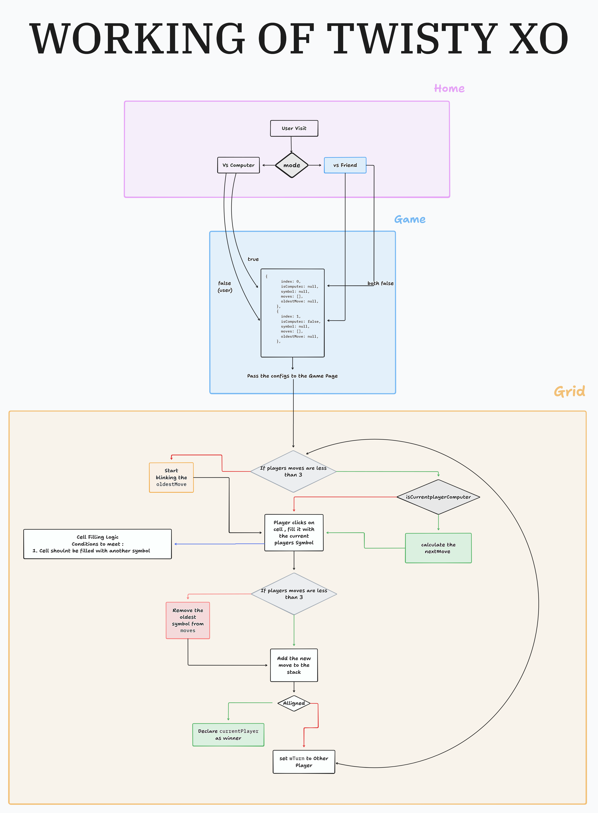

# Tic Tac Toe — No Draw Edition

Most Tic Tac Toe games end in a draw.  
That means the game stops being interesting long before it ends.

This project explores a simple question:  
**What happens when you redesign Tic Tac Toe so that a draw is impossible?**

---
## Interface Preview

Below are snapshots of key moments in the game experience, shown in the same order a player encounters them:

- Opponent selection screen  
- Active gameplay  
- Win result  
- Page not found screen  

These screens highlight the visual style, transitions, and responsive layout used throughout the game.

  
  
  


---

## Responsive Layout & Light Theme

The interface adapts smoothly across different screen sizes, from mobile devices to large desktop displays.
The visual theme can also be switched between light and dark modes.

The image below demonstrates:
- A mobile-sized layout
- A large-screen desktop layout
- The light theme in active use




---

## How the Game Works

1. The player first chooses an opponent:
   - Play against the computer  
   - Play against a friend  

2. Each player is allowed to have **only three active marks** on the board at any time.

3. When a player places a fourth mark:
   - Their **oldest mark is automatically removed**
   - The new mark takes its place

4. Because older moves disappear, the board is always changing.  
   This guarantees that:
   - The game never gets stuck
   - A draw is impossible
   - Every move has a consequence

5. The game ends immediately when a valid winning line is formed.

---

## How One Game Round Works (Logic Flow)

This diagram shows the full lifecycle of a single round —
from opponent selection to win detection and reset.



At a high level, each round follows this continuous loop:

1. The player selects an opponent.
2. A move is placed on the board.
3. The board updates and checks for a winner.
4. If no one has won yet:
   - The turn switches to the next player.
5. This loop continues until a winning alignment is formed.
6. Once a winner appears, the game pauses and allows a restart.

---

## How the Board State Is Managed

The entire game is driven by a single shared game state that tracks:

- Which cells are currently active  
- The order in which moves were placed  
- Whose turn it is  
- Whether a winner has been detected  

Each player is limited to **three active marks**.

When a fourth move is placed:
- The **oldest move is removed**
- The new move is added to the board

Instead of manually changing the interface,  
the game updates this central state first.  
The interface then automatically reflects the new state.

This keeps the game:
- Predictable  
- Easy to reset  
- Visually consistent  

---

## How the Computer Chooses Its Moves

The computer opponent follows a clear, rule-based process on every turn.  
It does not guess randomly and it does not use machine learning.

On each move, the computer evaluates the board in this exact order:

1. **Try to win immediately**  
   It checks every empty cell to see if placing a mark there would create a winning line.  
   If a winning move is found, it takes it instantly.

2. **Block the human player**  
   If it cannot win right away, it checks whether the human player could win on their next move.  
   If so, it places a mark there to block the win.

3. **Take the center**  
   If there is no win and no immediate danger, it takes the center cell if it is available.

4. **Take a corner**  
   If the center is not available, it randomly chooses one of the free corner cells.

5. **Fallback: choose any remaining free cell**  
   If none of the above options are available, it selects any other empty position.

Because the board constantly changes due to the three-move limit,  
the computer must continuously re-evaluate the board instead of following fixed patterns.

---

## Win Detection & Turn Switching

After every move, the game immediately checks all valid winning combinations.

- If a valid alignment is found:
  - The current player is declared the winner
  - The game stops accepting further input

- If no alignment exists:
  - The turn switches to the other player
  - The next move is allowed

This process repeats until a winner is found.  
Because older moves disappear over time, the game is always moving toward a conclusion.

---

## Known Design Challenges

Some design challenges that influenced the final system:

- Because players can only keep three active moves, long-term planning must constantly adapt.
- The computer opponent follows fixed rules, which makes its behavior predictable over time by experienced players.
- Rapid board updates required careful control of move validation and timing.

Each of these constraints directly shaped how the game logic and user experience were designed.

---

## What This Project Demonstrates

While the game appears simple on the surface, it demonstrates:

- Interactive state-driven game design  
- Rule-based decision making  
- Turn-based logic systems  
- Responsive interface layout  
- Animated UI feedback  
- Clean separation between game rules and interface  
- Real-world feature planning and iteration  

These skills were applied to a complete, playable system rather than isolated demos.

---

## Run the Project Locally

```bash
git clone https://github.com/MohammedAnasuddin/Twisty-XO
cd Twisty-XO
npm install
npm run dev
